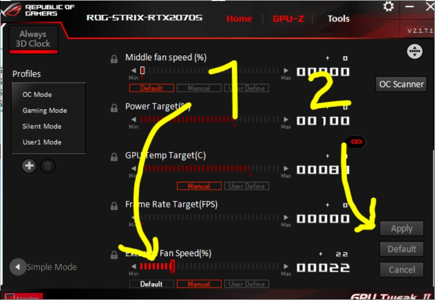
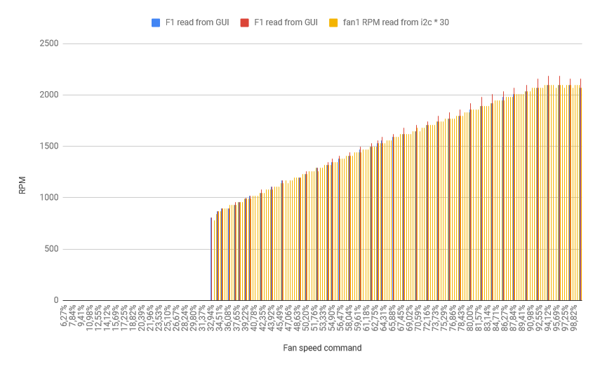

# Notes

## Goal

Graphic cards made by ASUS have their own [PWM fan headers](https://rog.asus.com/articles/gaming-graphics-cards/strix-gtx-10801070-what-is-asus-fancontrol/) that can be controlled via their specific app, for example to trigger extra air intake when you GPU is getting toast. The 'Technology' is called 'FanControl', and every time I will talk about fans here, I'm talking about these headers, and not the original fans that come screwed on top of the GPU.

The problem is I couldn't find any other tool to control it but [ASUS provided software](https://www.asus.com/us/site/graphics-cards/gpu-tweak-ii/).
It also turns out that their app is [kind](https://www.reddit.com/r/buildapc/comments/4cbb1y/discussion_bad_experience_with_asus_gpu_tweak_ii/) of [lame](https://www.reddit.com/r/nvidia/comments/99r9vo/asus_gpu_tweak_ii_killed_my_gtx_970/) and bloated and [might inject ads](https://www.guru3d.com/news_story/asus_gpu_tweak_ii_injects_ads_into_your_games.html) and install [terrible drivers](https://syscall.eu/blog/2020/03/30/asus_gio/), so it’d be cool to have something else.

In my case, I decided to "[deshroud](https://old.reddit.com/r/sffpc/comments/exncu9/deshrouded_asus_strix_rtx_2070_super_with_guide/)" (ie: remove the provided fans & plastic covering the whole thing) my new Asus Rog Strix RTX 2070s, so I could use slightly bigger and hopefull more silent fan, that I could orient as "exhaust".

So basically I want to be able to control these fan headers.

##  The GPUTweakII package

### GPUTweakII.exe

It is a 32b exe, that you run as Admin. You can download [here](https://dlcdnets.asus.com/pub/ASUS/Graphic%20Card/Unique_Applications/GPUTweakII-Version2171.zip) the version I used (2.1.7.1).

```
497482e1dbaccb01e6d523246120c81d  GPUTweakII.exe
```

The way you can change the "External" fans speed is to:
 * Set the speed mode to "Manual"
 * Change the speed via the terrible slider
 * Click a big ‘Apply’ button that seems to commit everything to the graphic card



### Loaded DLLs

So how do I do things?

The whole package comes with a bunch of binaries, DLLs, installed drivers and services and it's pretty tought figuring out where to start.

I was hinted towards looking at DLL being loaded by GPUTweakII with [ProcessExplorer](https://docs.microsoft.com/en-us/sysinternals/downloads/process-explorer).


Out of these, some of them come from the ASUS folder:

 * `AURA_DLL.dll`, which might be related to [blinky lights](https://www.asus.com/campaign/aura/global/)
 * `EIO.dll`  ooooh IO is good I guess?
 * `Exeio.dll` executive IO? even more interesing
 * `Vender.dll` looks lame
 * ̀ VGA_Extra.dll` sure why not

I then used [CFF Explorer](https://ntcore.com/?page_id=388) to see if any of these DLL has any interesting exported functions.

 * `EIO.dll`  has things like `ReadI2C`, nice
 * `Exeio.dll` has things like `GetFanDuty_ByReg`, interesting
 * `Vender.dll` also has a `ReadI2C` function, weird
 * ̀ VGA_Extra.dll` has functions like `GetDeviceBus`

All of theses looked kind of interesting.

At this point I start loading some of these dll in [IDA](https://www.hex-rays.com/products/ida/support/download_freeware/) and click around with not much success.

## WinDBG 101

My knowledge of WinDBG was basically getting PTSD from one insane "Windows internals" training week with Alex Ionescu, fortunately I had some friends to hold my hand and learn a couple tricks.

One of these is Breakpoints! Not knowing which DLL is interesting, one solution is just to break on every function from every of these interesting DLLs:

```
bm EIO!*
bm Exeio!*
bm Vender!*
bm VGA_Extra!*
```

and then manually set fan speed.

When doing this, a bunch of functions from Vender.dll kept being called, like `GetThermalInfor`, `VGA_GetMemoryUsage`, etc. even when I wasn't changing fan speed, so I would just use `bc` to remove these breakpoints that were not related to me changing fan speed.

I was left with calls to `Vender!ReadI2C` and `Vender!WriteI2C` everytime I would change fan speed in the app, as well as other stuff, but the fan speed would actually change on a call to `Vender!WriteI2C`.

So Vender.dll should be the next point of focus.


## Vender.dll

Firing up IDA, this is the listing for `WriteI2C`:
```
Vender!WriteI2C
.text:10014E90                 public WriteI2C
.text:10014E90 WriteI2C        proc near               ; DATA XREF: .rdata:off_10180E18↓o
.text:10014E90
.text:10014E90 var_30          = byte ptr -30h
.text:10014E90 var_10          = dword ptr -10h
.text:10014E90 var_4           = dword ptr -4
.text:10014E90 arg_0           = dword ptr  8
.text:10014E90 arg_4           = dword ptr  0Ch
.text:10014E90
.text:10014E90                 push    ebp
.text:10014E91                 mov     ebp, esp
.text:10014E93                 sub     esp, 30h
.text:10014E96                 mov     eax, ___security_cookie
.text:10014E9B                 xor     eax, ebp
.text:10014E9D                 mov     [ebp+var_4], eax
.text:10014EA0                 push    ebx
.text:10014EA1                 mov     ebx, [ebp+arg_4]
.text:10014EA4                 push    esi
.text:10014EA5                 mov     esi, [ebp+arg_0]
.text:10014EA8                 push    edi
.text:10014EA9                 mov     ecx, 0Bh
.text:10014EAE                 lea     edi, [ebp+var_30]
.text:10014EB1                 rep movsd
.text:10014EB3                 mov     eax, [ebp+var_10]
.text:10014EB6                 push    eax
.text:10014EB7                 call    sub_10014650 ; doesn't really go anywhere, maybe error handling
.text:10014EBC                 mov     ecx, dword_101C6EE8
.text:10014EC2                 add     esp, 4
.text:10014EC5                 mov     [ebp+var_10], eax
.text:10014EC8                 test    ecx, ecx
.text:10014ECA                 jnz     short loc_10014EDF
.text:10014ECC                 pop     edi
.text:10014ECD                 pop     esi
.text:10014ECE                 xor     al, al
.text:10014ED0                 pop     ebx
.text:10014ED1                 mov     ecx, [ebp+var_4]
.text:10014ED4                 xor     ecx, ebp
.text:10014ED6                 call    @__security_check_cookie@4 ; __security_check_cookie(x)
.text:10014EDB                 mov     esp, ebp
.text:10014EDD                 pop     ebp
.text:10014EDE                 retn
.text:10014EDF ; ---------------------------------------------------------------------------
.text:10014EDF
.text:10014EDF loc_10014EDF:                           ; CODE XREF: WriteI2C+3A↑j
.text:10014EDF                 mov     edx, [ecx]
.text:10014EE1                 mov     edx, [edx+48h]
.text:10014EE4                 push    ebx
.text:10014EE5                 lea     eax, [ebp+var_30]
.text:10014EE8                 push    eax
.text:10014EE9                 call    edx
.text:10014EEB                 mov     ecx, [ebp+var_4]
.text:10014EEE                 pop     edi
.text:10014EEF                 pop     esi
.text:10014EF0                 xor     ecx, ebp
.text:10014EF2                 pop     ebx
.text:10014EF3                 call    @__security_check_cookie@4 ; __security_check_cookie(x)
.text:10014EF8                 mov     esp, ebp
.text:10014EFA                 pop     ebp
.text:10014EFB                 retn
.text:10014EFB WriteI2C        endp
```

So what is edx at 0x10014EE9? Breaking there shows edx always pointing at the same thing, for example:
`72444ee9 ffd2            call    edx {Vender+0xeb90 (7243eb90)}`
So let's look at EB90:

```
.text:1000EB90 sub_1000EB90    proc near               ; DATA XREF: .rdata:1013DB34↓o
.text:1000EB90
.text:1000EB90 var_34          = dword ptr -34h
.text:1000EB90 var_30          = dword ptr -30h
.text:1000EB90 var_2C          = byte ptr -2Ch
.text:1000EB90 var_2B          = byte ptr -2Bh
.text:1000EB90 var_28          = dword ptr -28h
.text:1000EB90 var_24          = dword ptr -24h
.text:1000EB90 var_20          = dword ptr -20h
.text:1000EB90 var_1C          = dword ptr -1Ch
.text:1000EB90 var_18          = dword ptr -18h
.text:1000EB90 var_14          = dword ptr -14h
.text:1000EB90 var_10          = byte ptr -10h
.text:1000EB90 var_C           = dword ptr -0Ch
.text:1000EB90 var_8           = dword ptr -8
.text:1000EB90 var_4           = dword ptr -4
.text:1000EB90 arg_0           = dword ptr  8
.text:1000EB90 arg_4           = dword ptr  0Ch
.text:1000EB90
.text:1000EB90                 push    ebp
.text:1000EB91                 mov     ebp, esp
.text:1000EB93                 sub     esp, 34h
.text:1000EB96                 mov     eax, [ebp+arg_0]
.text:1000EB99                 push    esi
.text:1000EB9A                 push    edi
.text:1000EB9B                 mov     edi, [eax+20h]
.text:1000EB9E                 mov     eax, [ebp+arg_4]
.text:1000EBA1                 mov     edx, [eax+24h]
.text:1000EBA4                 mov     esi, ecx
.text:1000EBA6                 mov     cl, [eax+14h]
.text:1000EBA9                 mov     [ebp+var_2B], cl
.text:1000EBAC                 mov     ecx, [eax+18h]
.text:1000EBAF                 mov     [ebp+var_28], edx
.text:1000EBB2                 mov     edx, [eax+1Ch]
.text:1000EBB5                 mov     [ebp+var_24], ecx
.text:1000EBB8                 mov     ecx, 1
.text:1000EBBD                 mov     [ebp+var_1C], edx
.text:1000EBC0                 mov     dl, [eax+4]
.text:1000EBC3                 mov     eax, [eax+28h]
.text:1000EBC6                 mov     [ebp+var_C], ecx
.text:1000EBC9                 mov     [ebp+var_8], ecx
.text:1000EBCC                 lea     ecx, [ebp+var_8]
.text:1000EBCF                 mov     [ebp+var_10], dl
.text:1000EBD2                 push    ecx
.text:1000EBD3                 lea     edx, [ebp+var_34]
.text:1000EBD6                 mov     [ebp+var_20], eax
.text:1000EBD9                 mov     eax, [esi+edi*4+3E8h]
.text:1000EBE0                 push    edx
.text:1000EBE1                 push    eax
.text:1000EBE2                 mov     [ebp+var_34], 3002Ch
.text:1000EBE9                 mov     [ebp+var_18], 0FFFFh
.text:1000EBF0                 mov     [ebp+var_14], 6
.text:1000EBF7                 mov     [ebp+var_2C], 0
.text:1000EBFB                 mov     [ebp+var_30], 0
.text:1000EC02                 mov     [ebp+var_4], 0
.text:1000EC09                 call    sub_1001B250
.text:1000EC0E                 add     esp, 0Ch
.text:1000EC11                 cmp     eax, 0FFFFFFF7h
.text:1000EC14                 jnz     short loc_1000EC35
.text:1000EC16                 mov     eax, [esi+edi*4+3E8h]
.text:1000EC1D                 lea     ecx, [ebp+var_8]
.text:1000EC20                 push    ecx
.text:1000EC21                 lea     edx, [ebp+var_34]
.text:1000EC24                 push    edx
.text:1000EC25                 push    eax
.text:1000EC26                 mov     [ebp+var_34], 20024h
.text:1000EC2D                 call    sub_1001B250
.text:1000EC32                 add     esp, 0Ch
.text:1000EC35
.text:1000EC35 loc_1000EC35:                           ; CODE XREF: sub_1000EB90+84↑j
.text:1000EC35                 test    eax, eax
.text:1000EC37                 pop     edi
.text:1000EC38                 setz    al
.text:1000EC3B                 pop     esi
.text:1000EC3C                 mov     esp, ebp
.text:1000EC3E                 pop     ebp
.text:1000EC3F                 retn    8
.text:1000EC3F sub_1000EB90    endp
```

Interesting thing is the double call to `sub_1001B250`, which start like this:

```
.text:1001B250 sub_1001B250    proc near               ; CODE XREF: sub_1000EB90+79↑p
.text:1001B250                                         ; sub_1000EB90+9D↑p
.text:1001B250
.text:1001B250 var_8           = dword ptr -8
.text:1001B250 var_4           = dword ptr -4
.text:1001B250 arg_0           = dword ptr  4
.text:1001B250 arg_4           = dword ptr  8
.text:1001B250 arg_8           = dword ptr  0Ch
.text:1001B250
.text:1001B250                 sub     esp, 8
.text:1001B253                 push    esi
.text:1001B254                 push    offset Addend   ; lpAddend
.text:1001B259                 call    ds:InterlockedIncrement
.text:1001B25F                 push    0
.text:1001B261                 push    0
.text:1001B263                 call    sub_10019BF0
.text:1001B268                 mov     esi, eax
.text:1001B26A                 add     esp, 8
.text:1001B26D                 test    esi, esi
.text:1001B26F                 jnz     loc_1001B30D
.text:1001B275                 mov     eax, dword_101C7470
.text:1001B27A                 test    eax, eax
.text:1001B27C                 jnz     short loc_1001B2AF
.text:1001B27E                 mov     eax, dword_101C7268
.text:1001B283                 test    eax, eax
.text:1001B285                 jz      short loc_1001B29A
.text:1001B287                 push    283AC65Ah
.text:1001B28C                 call    eax ; dword_101C7268
.text:1001B28E                 add     esp, 4
.text:1001B291                 test    eax, eax
.text:1001B293                 mov     dword_101C7470, eax
.text:1001B298                 jnz     short loc_1001B2AF
```

The constant here is cool and googling for 283AC65A [tells you](https://github.com/tokkenno/nvapi.net/wiki/NvAPI-Functions) this is a constant used to access `NvAPI_I2CWriteEx` in `nvapi.dll`

This function has seen some interest, from the [OpenRGB](https://gitlab.com/CalcProgrammer1/OpenRGB/-/issues/7) project, which makes the blinky lights go blink, and other things.

This is also where things get dark and obscure. Nvidia offers [some documentation](https://docs.nvidia.com/gameworks/content/gameworkslibrary/coresdk/nvapi/group__i2capi.html#gaf7e90150d628f012642c4b61f9781d87) around its NVAPI framework, but it only lists `NvAPI_I2CWrite` and not `NvAPI_I2CWriteEx`.

We still can extract some interesting information from these docs, for one, It seems that NvAPI_I2CWrite is for 'DDC port'. These ports are for actually talking to your monitor. It makes sense we might not want to use this function, as we're not really talking to the monitor.

One [Rust package](https://arcnmx.github.io/nvapi-rs/nvapi_hi/sys/i2c/private/fn.NvAPI_I2CWriteEx.html) seems to provide some documentation about that function, it also tells us about what the corresponding struct for NV_I2C_INFO_EX_V3 would look like.

## NVAPI

Friends helped me understand how the argument massaging & passing to the actual call to `NvAPI_I2CWriteEx` was happening, and that the structure that contains info is actually set in `sub_1000EB90`. So what is that structure like?


So back to IDA to set this as the type of our struct, being taught at the same time about the importance of aligning your fields, and how much of a nightmare can IDA be for doing what looks like simple things.

We're definitely calling NvAPI_I2CWriteEx, so this means we want a NV_I2C_INFO_EX_V3, right? So, using the struct from the previous [Rust package](https://arcnmx.github.io/nvapi-rs/nvapi_hi/sys/i2c/private/fn.NvAPI_I2CWriteEx.html), we add our struct to IDA:

```
00000000 NV_I2C_INFO_EX_V3 struc ; (sizeof=0x28, mappedto_255)
00000000 version         dd ?
00000004 display_mask    dd ?
00000008 is_ddc_port     db ?
00000009 i2c_dev_address db ?   // Address of device on the I2C bus
0000000A                 db ? ; undefined
0000000B                 db ? ; undefined
0000000C i2c_reg_address dd ?   // pointer to the Address of the register we're accessing on the i2c device
00000010 data            dd ?   // pointer to byte array
00000014 read            dd ?
00000018 size            dd ?
0000001C i2c_speed_khz   dd ?
00000020 portId          db ?
00000021                 db ? ; undefined
00000022                 db ? ; undefined
00000023                 db ? ; undefined
00000024 is_port_id_set  dd ?
00000028 NV_I2C_INFO_EX_V3 ends
```

In Ida, doubleclick on var_34, and from the stack view, apply the new type you just created.

But there is a problem. Doing this it looks like some expected values are not where they should be.
Most noticably, i2c_speed_khz is 0xFFFF, which is absoltely not near any of the [standard I2C speeds](https://www.i2c-bus.org/speed/).

On the other hand, the [OpenRGB](https://github.com/CalcProgrammer1/OpenRGB/blob/7b120515d802204ff5cc04df0c059d6eb1bfbc5e/dependencies/NVFC/nvapi.h#L455) project did quite a bunch of reverse engineering around that function, for the blinky lights parts, and we learn there that the struct used by NvAPI_I2CWriteEx is of type [NV_I2C_INFO_V3 which is actually documented by Nvidia](https://docs.nvidia.com/gameworks/content/gameworkslibrary/coresdk/nvapi/structNV__I2C__INFO__V3.html)

So let's try NV_I2C_INFO_V3 instead:

```
NV_I2C_INFO_V3  struc ; (sizeof=0x2C, mappedto_255)
; XREF: nv_writei2c_wrapper/r
00000000 version         dd ?
00000000
00000004 display_mask    dd ?
00000008 is_ddc_port     db ?
00000009 i2c_dev_address db ?   // Address of device on the I2C bus
0000000A                 db ? ; undefined
0000000B                 db ? ; undefined
0000000C i2c_reg_address dd ?   // pointer to the Address of the register we're accessing on the i2c device
00000010 reg_addr_size   dd ?
00000014 data            dd ?   // pointer to byte array
00000018 size            dd ?   // size of data
0000001C i2c_speed       dd ?   // deprecated and should always be always 0xFFFF
00000020 i2c_speed_khz   dd ?   // Enum of values
00000024 portId          db ?
00000025                 db ? ; undefined
00000026                 db ? ; undefined
00000027                 db ? ; undefined
00000028 is_port_id_set  dd ?
0000002C NV_I2C_INFO_V3  ends
```

This lets us confirm that some values statically set in the code in IDA match expectations:

 * `version` is a constant
 * `i2c_speed` is [correctly set to `0xffff`](https://docs.nvidia.com/gameworks/content/gameworkslibrary/coresdk/nvapi/structNV__I2C__INFO__V3.html#ade08a919e3a998a57c474cc34f894ce7)
 * `i2c_speed_khz` is set to `6` which means `NVAPI_I2C_SPEED_400KHZ`

One very important thing to note in the documentation is this part:

```
NvU8 NV_I2C_INFO_V3::i2cDevAddress

The address of the I2C slave. The address should be shifted left by one. For example, the I2C address 0x50, often used for reading EDIDs, would be stored here as 0xA0. This matches the position within the byte sent by the master, as the last bit is reserved to specify the read or write direction.
```

This means the address we see for the i2c device here, should be shifted right to get the actual address and `0x54 >> 1` is `0x2a` (OMGLOL 42).

## WinDBG 102

Since we have a nice struct, let's ask WinDBG to show us the contents of it. It would be super nice to be able to trace
all calls to this function and display the values of the NV_I2C_INFO_V3 struct fields.

We know the call to the wrapper to the NvAPI_I2CWriteEx function happens at
1000EC09 which is (0x10014E90 - 0x1000EC09) = 0x6287 from Vender!WriteI2C.

This is where the WinDbg scripting part gets super annoying, but let's do this!

```
bp Vender!WriteI2C - 0x6287 "r$t0=poi(poi(@esp+4)+4);r$t1=by(poi(@esp+4)+8);r$t2=by(poi(@esp+4)+9);r$t3=poi(poi(poi(@esp+4)+c));r$t4=poi(poi(@esp+4)+10);r$t5=by(poi(poi(@esp+4)+14));r$t6=poi(poi(@esp+4)+18);r$t7=by(poi(@esp+4)+24);r$t8=poi(poi(@esp+4)+28);.echotime;.printf\"[%08x] WRITE DispMask=%08x,IsDDCPort=%02x,DevAddress=%02x, RegAddress=%02x, RegAddressSize=%08x, Data=%02x, Size=%02x, PortID=%02x, IsPortIDSet=%08x\\n\",@$tpid,@$t0,@$t1,@$t2,@$t3,@$t4,@$t5,@$t6,@$t7,@$t8;gc"
```

Let's split that. Offsets from @esp+4 are read from the struct display in IDA.
```
bp Vender!WriteI2C - 0x6287  \\ BP address
"r$t0=poi(poi(@esp+4)+4);  \\ display_mask is a dword
r$t1=by(poi(@esp+4)+8);    \\ is_ddc_port is a byte
r$t2=by(poi(@esp+4)+9);    \\ i2c_dev_address is a byte
r$t3=poi(poi(poi(@esp+4)+c));   \\ i2c_reg_address is a pointer to a dword
r$t4=poi(poi(@esp+4)+10);       \\ reg_addr_size is a dword (always 1, as we'll see after tracing)
r$t5=by(poi(poi(@esp+4)+14))    \\ data is a pointer to a byte (always only one as size is always 1)
r$t6=poi(poi(@esp+4)+18);       \\ size is a dword
r$t7=by(poi(@esp+4)+24);        \\ portId is a byte (we ignore i2c_speed & i2c_speed_khz as both as hardcoded
r$t8=poi(poi(@esp+4)+28);       \\ is_ddc_port  is a dword
.echotime;       \\ display a timestamp
.printf\"[%08x] WRITE DispMask=%08x,IsDDCPort=%02x,DevAddress=%02x, RegAddress=%02x, RegAddressSize=%08x, Data=%02x, Size=%02x, PortID=%02x, IsPortIDSet=%08x\\n\",@$tpid,@$t0,@$t1,@$t2,@$t3,@$t4,@$t5,@$t6,@$t7,@$t8;
gc"  // continue execution
```

Now fireup GPUTweakII.exe, attach to it in WinDbg, set your magic breakpoint, and start changing fan speed in the GUI, and we start seeing stuff like:

```
<snip>
WRITE DispMask=00000000,IsDDCPort=00,DevAddress=54, RegAddress=07, RegAddressSize=00000001, Data=01, Size=01, PortID=01, IsPortIDSet=00000001
Debugger (not debuggee) time: Wed Apr  8 15:48:48.950 2020 (UTC + 2:00)
WRITE DispMask=00000000,IsDDCPort=00,DevAddress=54, RegAddress=04, RegAddressSize=00000001, Data=22, Size=01, PortID=01, IsPortIDSet=00000001
Debugger (not debuggee) time: Wed Apr  8 15:48:48.955 2020 (UTC + 2:00)
WRITE DispMask=00000000,IsDDCPort=00,DevAddress=54, RegAddress=05, RegAddressSize=00000001, Data=22, Size=01, PortID=01, IsPortIDSet=00000001
Debugger (not debuggee) time: Wed Apr  8 15:48:48.960 2020 (UTC + 2:00)
WRITE DispMask=00000000,IsDDCPort=00,DevAddress=54, RegAddress=06, RegAddressSize=00000001, Data=22, Size=01, PortID=01, IsPortIDSet=00000001
Debugger (not debuggee) time: Wed Apr  8 15:48:48.982 2020 (UTC + 2:00)
WRITE DispMask=00000000,IsDDCPort=00,DevAddress=54, RegAddress=04, RegAddressSize=00000001, Data=22, Size=01, PortID=01, IsPortIDSet=00000001
Debugger (not debuggee) time: Wed Apr  8 15:48:48.987 2020 (UTC + 2:00)
WRITE DispMask=00000000,IsDDCPort=00,DevAddress=54, RegAddress=05, RegAddressSize=00000001, Data=22, Size=01, PortID=01, IsPortIDSet=00000001
Debugger (not debuggee) time: Wed Apr  8 15:48:48.989 2020 (UTC + 2:00)
WRITE DispMask=00000000,IsDDCPort=00,DevAddress=54, RegAddress=06, RegAddressSize=00000001, Data=22, Size=01, PortID=01, IsPortIDSet=00000001
Debugger (not debuggee) time: Wed Apr  8 15:48:49.012 2020 (UTC + 2:00)
WRITE DispMask=00000000,IsDDCPort=00,DevAddress=54, RegAddress=04, RegAddressSize=00000001, Data=22, Size=01, PortID=01, IsPortIDSet=00000001
Debugger (not debuggee) time: Wed Apr  8 15:48:49.022 2020 (UTC + 2:00)
WRITE DispMask=00000000,IsDDCPort=00,DevAddress=54, RegAddress=05, RegAddressSize=00000001, Data=22, Size=01, PortID=01, IsPortIDSet=00000001
Debugger (not debuggee) time: Wed Apr  8 15:48:49.024 2020 (UTC + 2:00)
WRITE DispMask=00000000,IsDDCPort=00,DevAddress=54, RegAddress=06, RegAddressSize=00000001, Data=22, Size=01, PortID=01, IsPortIDSet=00000001
Debugger (not debuggee) time: Wed Apr  8 15:48:49.032 2020 (UTC + 2:00)
<snip>
```

Nice! This shows all writes are indeed 1 byte long, which makes the WinDbg unpacking easier. We also confirm "isDDCPort" is set to "false".

This is a LOT of calls for what should be just a single command sent to the fans controler. But it turns out the RGB LED on the GPU will also
do some show for you as you commit the new speed values.

I decided to remove `gc` at the end of the BP macros, so I could see which call actually made the fan turn, and after typing the go command
a couple dozen times, finally:

```
WRITE DispMask=00000000,IsDDCPort=00,DevAddress=54, RegAddress=41, RegAddressSize=00000001, Data=ff, Size=01, PortID=01, IsPortIDSet=00000001
```

Got it! Setting "External fans to 100% speed" in the GUI means I get a 0xFF there, and 60% gives me 0x99, which is indeed 60% of 0xff.


## Linux

It's time to see how lucky we are.

Linux will scan for all interesting SMBus/I2C devices connected, and can expose them in a very simple to use way using the module `i2c-dev`.

Let's see if I can see a device with address 0x54.

```
# modprobe i2c-dev
# i2cdetect -l
i2c-3   i2c             NVIDIA i2c adapter 3 at 7:00.0          I2C adapter
i2c-1   smbus           SMBus PIIX4 adapter port 2 at 0b00      SMBus adapter
i2c-6   i2c             NVIDIA i2c adapter 7 at 7:00.0          I2C adapter
i2c-4   i2c             NVIDIA i2c adapter 5 at 7:00.0          I2C adapter
i2c-2   i2c             NVIDIA i2c adapter 1 at 7:00.0          I2C adapter
i2c-0   smbus           SMBus PIIX4 adapter port 0 at 0b00      SMBus adapter
i2c-7   i2c             NVIDIA i2c adapter 8 at 7:00.0          I2C adapter
i2c-5   i2c             NVIDIA i2c adapter 6 at 7:00.0          I2C adapter
```

Cool! NVIDIA stuff, this is promising. Unfortunately sensors-detect won't find anything on these:

```
Next adapter: NVIDIA i2c adapter 1 at 7:00.0 (i2c-2)
Do you want to scan it? (yes/NO/selectively):

Next adapter: NVIDIA i2c adapter 3 at 7:00.0 (i2c-3)
Do you want to scan it? (yes/NO/selectively):

Next adapter: NVIDIA i2c adapter 5 at 7:00.0 (i2c-4)
Do you want to scan it? (yes/NO/selectively):

Next adapter: NVIDIA i2c adapter 6 at 7:00.0 (i2c-5)
Do you want to scan it? (yes/NO/selectively):

Next adapter: NVIDIA i2c adapter 7 at 7:00.0 (i2c-6)
Do you want to scan it? (yes/NO/selectively):

Next adapter: NVIDIA i2c adapter 8 at 7:00.0 (i2c-7)
Do you want to scan it? (yes/NO/selectively):

```

So lm-sensors didn't find anything there. Let's scan these devices anyway.

```
# i2cdetect -y 2
     0  1  2  3  4  5  6  7  8  9  a  b  c  d  e  f
00:          -- -- -- -- -- 08 -- -- -- -- -- -- --
10: -- -- -- -- -- 15 -- -- -- -- -- -- -- -- -- --
20: -- -- -- -- -- -- -- 27 -- -- 2a -- -- -- -- --
30: -- -- -- -- -- -- -- -- -- -- -- -- -- -- -- --
40: -- -- -- -- -- -- -- -- -- -- -- -- -- -- -- --
50: -- -- -- -- -- -- -- -- -- -- -- -- -- -- -- --
60: -- -- -- -- -- -- -- -- 68 -- -- -- -- -- -- --
70: -- -- -- -- -- -- -- --

# i2cdetect -y 4
     0  1  2  3  4  5  6  7  8  9  a  b  c  d  e  f
00:          -- -- -- -- -- -- -- -- -- -- -- -- --
10: -- -- -- -- -- -- -- -- -- -- -- -- -- -- -- --
20: -- -- -- -- -- -- -- -- -- -- -- -- -- -- -- --
30: 30 31 32 33 34 35 36 37 -- -- -- -- -- -- -- --
40: -- -- -- -- -- -- -- -- -- -- -- -- -- -- -- --
50: 50 51 52 53 54 55 56 57 58 59 5a 5b 5c 5d 5e 5f
60: -- -- -- -- -- -- -- -- -- -- -- -- -- -- -- --
70: -- -- -- -- -- -- -- --
```
Other i2c devices don't return much here, but we definitely got something at 0x2a!

Time to try and talk to it. Install [i2c-tools](https://packages.debian.org/search?searchon=sourcenames&keywords=i2c-tools) and do:

```
# i2cset 2 0x2a 0x41 0xFF
WARNING! This program can confuse your I2C bus, cause data loss and worse!
I will write to device file /dev/i2c-2, chip address 0x2a, data address
0x41, data 0x15, mode byte.
Continue? [Y/n]
```

And BOOM! FANS GO BRRRR!

While this would be kind of enough to write a very simple loop that would set the fan speed according to the GPU temperature (that you can already
get with nvidia-smi in CLI on Linux), I wanted MORE.

## Back to windows

So we know how to talk to the fans, but can we also ask them to tell us more things?

The GUI displays current fan speed (even when set automatically by the background service) and also current RPM of both fans.

I was wondering how the current RPM could be known by the tool. It had to be measured at some point, since not all fans will rotate
at the same maximum speed.

Since we know about NvAPI_I2CWriteEx, let's now look for NvAPI_I2CReadEx.
According to the [list of magic numbers](https://github.com/tokkenno/nvapi.net/wiki/NvAPI-Functions), this is going to be 0x4D7B0709.

Search for this value in IDA and you'll find another function at 0x1001B320 very similar to sub_1001B250. This one being called (twice) in sub_1000EAD0,
which is also very similar to sub_1000EB90. It is indeed using the same NV_I2C_INFO_V3 structure, so it's super easy to add a new breakpoint:

```
bp Vender!ReadI2C - 0x62cf "r$t0=poi(poi(@esp+4)+4);r$t1=by(poi(@esp+4)+8);r$t2=by(poi(@esp+4)+9);r$t3=poi(poi(poi(@esp+4)+c));r$t4=poi(poi(@esp+4)+10);r$t5=by(poi(poi(@esp+4)+14));r$t6=poi(poi(@esp+4)+18);r$t7=by(poi(@esp+4)+24);r$t8=poi(poi(@esp+4)+28);.echotime;.printf\"[%08x] READ DispMask=%08x,IsDDCPort=%02x,DevAddress=%02x, RegAddress=%02x, RegAddressSize=%08x, Data=%02x, Size=%02x, PortID=%02x, IsPortIDSet=%08x\\n\",@$tpid,@$t0,@$t1,@$t2,@$t3,@$t4,@$t5,@$t6,@$t7,@$t8;gc";

```

Now that we can trace reads & write, I wanted to trace all accesses to these methods from the GUI, as soon as it starts. I also started tracing
its companion app "Monitor.exe", which is the one showing the nice graphs (and RPM values) and we now have even more info:

For GPUTweakII.exe:
```
[00003a88] READ DispMask=00000000,IsDDCPort=00,DevAddress=00, RegAddress=00, RegAddressSize=00000000, Data=00, Size=01, PortID=01, IsPortIDSet=00000001
Debugger (not debuggee) time: Wed Apr  8 18:37:42.866 2020 (UTC + 2:00)
[00003a88] READ DispMask=00000000,IsDDCPort=00,DevAddress=02, RegAddress=00, RegAddressSize=00000000, Data=00, Size=01, PortID=01, IsPortIDSet=00000001
Debugger (not debuggee) time: Wed Apr  8 18:37:42.877 2020 (UTC + 2:00)
[00003a88] READ DispMask=00000000,IsDDCPort=00,DevAddress=04, RegAddress=00, RegAddressSize=00000000, Data=00, Size=01, PortID=01, IsPortIDSet=00000001
Debugger (not debuggee) time: Wed Apr  8 18:37:42.880 2020 (UTC + 2:00)
[00003a88] READ DispMask=00000000,IsDDCPort=00,DevAddress=06, RegAddress=00, RegAddressSize=00000000, Data=00, Size=01, PortID=01, IsPortIDSet=00000001
<snip>
[00003a88] READ DispMask=00000000,IsDDCPort=00,DevAddress=54, RegAddress=20, RegAddressSize=00000001, Data=15, Size=01, PortID=01, IsPortIDSet=00000001
Debugger (not debuggee) time: Wed Apr  8 18:37:43.386 2020 (UTC + 2:00)
[00003a88] READ DispMask=00000000,IsDDCPort=00,DevAddress=54, RegAddress=21, RegAddressSize=00000001, Data=89, Size=01, PortID=01, IsPortIDSet=00000001
Debugger (not debuggee) time: Wed Apr  8 18:37:43.641 2020 (UTC + 2:00)
[00003a88] READ DispMask=00000000,IsDDCPort=00,DevAddress=54, RegAddress=41, RegAddressSize=00000001, Data=00, Size=01, PortID=01, IsPortIDSet=00000001
Debugger (not debuggee) time: Wed Apr  8 18:37:43.645 2020 (UTC + 2:00)
[00003a88] READ DispMask=00000000,IsDDCPort=00,DevAddress=54, RegAddress=25, RegAddressSize=00000001, Data=80, Size=01, PortID=01, IsPortIDSet=00000001
Debugger (not debuggee) time: Wed Apr  8 18:37:43.650 2020 (UTC + 2:00)
[00003a88] READ DispMask=00000000,IsDDCPort=00,DevAddress=54, RegAddress=26, RegAddressSize=00000001, Data=ff, Size=01, PortID=01, IsPortIDSet=00000001
Debugger (not debuggee) time: Wed Apr  8 18:37:43.653 2020 (UTC + 2:00)
[00003a88] READ DispMask=00000000,IsDDCPort=00,DevAddress=54, RegAddress=28, RegAddressSize=00000001, Data=3c, Size=01, PortID=01, IsPortIDSet=00000001
Debugger (not debuggee) time: Wed Apr  8 18:37:43.656 2020 (UTC + 2:00)
[00003a88] READ DispMask=00000000,IsDDCPort=00,DevAddress=54, RegAddress=29, RegAddressSize=00000001, Data=50, Size=01, PortID=01, IsPortIDSet=00000001
Debugger (not debuggee) time: Wed Apr  8 18:37:43.659 2020 (UTC + 2:00)
[00003a88] READ DispMask=00000000,IsDDCPort=00,DevAddress=54, RegAddress=27, RegAddressSize=00000001, Data=32, Size=01, PortID=01, IsPortIDSet=00000001
Debugger (not debuggee) time: Wed Apr  8 18:37:43.747 2020 (UTC + 2:00)
[00003a88] READ DispMask=00000000,IsDDCPort=00,DevAddress=54, RegAddress=41, RegAddressSize=00000001, Data=00, Size=01, PortID=01, IsPortIDSet=00000001
<snip, more of the same>
```
Two things going on there: first we see the software trying all even (why?) i2c device addresses, maybe checking the status of the call to NvAPI_I2CReadEx
(kind of the same as us doing i2c-detect in linux), then setting on address 0x54 (actually 0x2a), and then reading some values on registers
0x20, 0x21, 0x25, 0x26, 0x27, 0x28, 0x29.

The monitor tool is a bit different, it only goes over these 3 'reads':

```
Debugger (not debuggee) time: Thu Apr  9 14:35:57.900 2020 (UTC + 2:00)
[0000299c] READ DispMask=00000000,IsDDCPort=00,DevAddress=54, RegAddress=44, RegAddressSize=00000001, Data=48, Size=01, PortID=01, IsPortIDSet=00000001
Debugger (not debuggee) time: Thu Apr  9 14:35:57.931 2020 (UTC + 2:00)
[0000299c] READ DispMask=00000000,IsDDCPort=00,DevAddress=54, RegAddress=41, RegAddressSize=00000001, Data=ff, Size=01, PortID=01, IsPortIDSet=00000001
Debugger (not debuggee) time: Thu Apr  9 14:35:57.946 2020 (UTC + 2:00)
[0000299c] READ DispMask=00000000,IsDDCPort=00,DevAddress=54, RegAddress=48, RegAddressSize=00000001, Data=4b, Size=01, PortID=01, IsPortIDSet=00000001
```
0x41 is the fan speed (here fans were at 100%), and 2 values that are almost the same on 0x44 & 0x48, and seem to grow linearly with fan speed (in percent).
Could it be RPM? The Monitor does report speed for each of the 2 external fans.


## Back to Linux again

In order to figure out what these values meant, I wrote a little script that would send a fan speed
command every couple seconds, and then read the values of registers:

```
$log = File.new("/tmp/log", 'a+')
def read(bus, device, address)
  cmd = "i2cget -y #{bus} 0x#{device.to_s(16)} 0x#{address.to_s(16)}"
  io = IO.popen(cmd)
  r = io.read()
  io.close()
  return r.strip()
end

def write(bus, device, address, val)
  cmd = "i2cset -y #{bus} 0x#{device.to_s(16)} 0x#{address.to_s(16)} 0x#{val.to_s(16)}"
  io = IO.popen(cmd)
  io.close()
end

0.upto(255) do |i|
  write(2, 0x2a, 0x41, i)
  sleep 3
  f1 = read(2, 0x2a, 0x44)
  f2 = read(2, 0x2a, 0x48)
  m =  "Wrote 0x#{i.to_s(16)}. Read f1: #{f1} f2: #{f2}\n"
  puts m
  $log.write(m)
end
$log.close()

```

I also went back to windows for a bit, manually set fan speed commands, and read the displayed values for fan RPM.
It turns out that if the values read by i2c are multiplied by 30, I totally get the current RPM speed!




We can also see how any command below 30% just means the fans won't go. Each pc fan has a minimum RPM it won't actually
go below of, this is due to the inertia of the fan blades. Later tests showed I could go lower on fan speed if I first set
them over that minimum and gradually set a lower command (down to ~25% of max speed).

So where is the 30 factor coming from?

Fans usually report their speed via a dedicated wire, and they will send a certain number of pulses (usually 2) each rotation.
Getting N pulsation per second, means N/2 rotation per second, and 60*N/2= N*30 RPM.

So it would make sense that the register on addresses 0x44 & 0x48 are returning 'pulses per seconds' which need to be converted
into RPM.

## Even more research

I now have enough information to write a very basic userland tool, but I also found more information with a bit more research

### HWiNFO

While searching whether the external fans could be controlled by another tool, I stumbled upon [HWiNFO](https://www.hwinfo.com/download/).
It is a freeware that also does i2c probing and reports all kind of sensors reporting.

I was surprised to see it is able to actually detect my external fans (but not control them). It report the sensor controller being
used as "ITE IT8915FN".

While I couldn't find any public datasheet for this chipset, this definitely made me remember of the values read by ASUS tools during the
detection phase: 0x20 would return 0x15 and 0x21 would return 0x89, which definitely looks like a way to detect they are talking to the proper chip!

### ASUSGPUFanServiceEx.exe

GPUTweakII.exe also spins up another process called `ASUSGPUFanServiceEx.exe`, which, tracing it, seems like it's the process
which makes sure to change fan speed depending on GPU temp.
It does some other stuff on i2c:

```
Debugger (not debuggee) time: Wed Apr  8 15:02:04.839 2020 (UTC + 2:00)
WRITE DevAddress=54, RegAddress=43, Data=00
WRITE DevAddress=54, RegAddress=47, Data=00
Debugger (not debuggee) time: Wed Apr  8 15:02:10.862 2020 (UTC + 2:00)
READ DevAddress=54, RegAddress=45, Data=01
WRITE DevAddress=54, RegAddress=43, Data=01
Debugger (not debuggee) time: Wed Apr  8 15:02:10.866 2020 (UTC + 2:00)
READ DevAddress=54, RegAddress=49, Data=01
Debugger (not debuggee) time: Wed Apr  8 15:02:10.867 2020 (UTC + 2:00)
WRITE DevAddress=54, RegAddress=47, Data=01
```

Windows is going to require something to use Nvapi.dll, and although Linux doesn't have a Nvapi.dll version, I can still talk
directly to the i2c device. In order to make it play nicely with [fancontrol/](https://hwmon.wiki.kernel.org/lm_sensors), I need
to write a [hwmon driver](https://www.kernel.org/doc/Documentation/hwmon/hwmon-kernel-api.txt).


## TODO

I have yet to figure out what 0x43, 0x47 & 0x49 are for. 0x43 & 0x47 are set to 0 then 1, every 4 minutes or so, while 0x49 ie read and contains 0x01.
