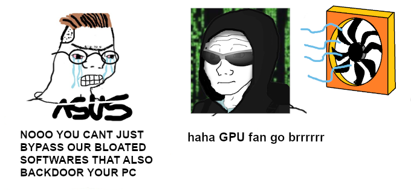

# NvapiFans

Control external fans (ie: connected via the FanConnect headers) on ASUS ROG Strix 2070 Super.

Might work on other ASUS graphic cards.

## Disclaimer

These tools are modifying the physical state of your computer. It might be doing things wrong, and
I want to have nothing to do if you brick your expensive gear.

## Installation / Usage

See relevant documents per platform:
  * [Linux](linux/README.md), only tested with non-free Nvidia drivers.
  * [Windows](win/README.md)

## Research notes / Write Up

See [NOTES.md](NOTES.md)

## Acknowledgement

* [Trou](https://twitter.com/_trou_/) for making sense of assembly
* [x0rbl](https://twitter.com/x0rbl) for his knowledge of the dark magics that are c++ & WinDBG
